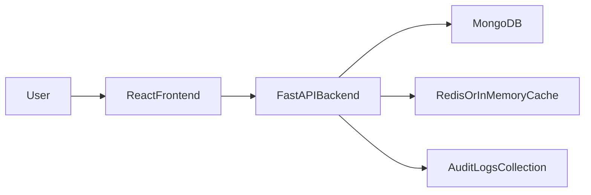

# Informal Code Review (Written)

## Audience and purpose

This is a written, informal code review intended for a peer or manager. It is designed to be read quickly and to support engineering decision making. It explains:

- What the system does
- Where the original artifact had constraints
- What was improved and why
- How the enhancements map to CS 499 outcomes

> **Note on the “video” requirement:** A code review video is not included. Instead, this document serves as the code review deliverable. It is structured to demonstrate collaborative review practices, clear communication, and evidence-based engineering decisions.

## Existing functionality (before enhancements)

The original artifact was a Jupyter Notebook application using Dash to present animal shelter data from MongoDB. Key features:

- Filter animals by rescue category using predefined rules
- Display a table of results
- Display map and breed analytics visualizations
- Perform basic CRUD-style reads with direct database access

The original structure worked for coursework, but it constrained maintainability, deployment, and security.

## High-level system view (after enhancements)

This enhancement converted the artifact to a production-style three-tier design:

## Code analysis: opportunities for improvement

### Architecture and maintainability

- Monolithic notebook structure made modular reuse difficult.
- UI code and database logic were tightly coupled.
 - Limited separation of concerns made regression risk higher during changes.

### Security and compliance

- No authentication or authorization.
- No audit trail for data operations.
 - Limited ability to support regulated-industry expectations (traceability and accountability).

### Scalability and performance

- Search patterns relied on basic matching.
- Database could be stressed by repeated reads.
- Limited support for efficient autocomplete/fuzzy search.
 - Limited support for analytics without transferring large datasets to the application.

### Testing and quality

- Limited automated testing compared to what is expected in a professional environment.
 - No clear boundary to unit-test business logic separately from the UI layer.

## Enhancements implemented (what changed and why)

### Software engineering and design

- Migrated from notebook-based Dash app into a production-style three-tier architecture:
  - React frontend
  - FastAPI backend
  - MongoDB (and Redis-backed caching)

- Added security controls:
  - JWT authentication
  - Role-based authorization (admin vs user)
  - Rate limiting and security headers

- Added a service layer to keep code modular and testable.
 - Organized the code so future enhancements can be delivered incrementally with lower regression risk.

### Algorithms and data structures

Enhancements were selected based on real user behavior (search and repeated reads):

- Trie-based autocomplete for breed/name prefix search
- Fuzzy search using edit-distance similarity
- Cache layer with TTL and invalidation to reduce repeated database reads

**Trade-offs (explicit):**

- Trie-based autocomplete improves query time for prefix searches but costs memory and requires initialization strategy.
- Caching improves latency and reduces DB load, but introduces invalidation/consistency complexity (managed via TTL + invalidation patterns + fallbacks).
- Fuzzy matching improves usability (typo tolerance) but increases compute cost; thresholds and limits manage this trade-off.

### Databases

- Implemented compound indexing strategy based on query patterns
- Added aggregation pipelines for analytics
- Added audit logging collection for traceability

**Trade-offs (explicit):**

- Indexes speed reads but add write overhead; indexes were targeted to known access patterns.
- Aggregation pipelines reduce network transfer and app compute but require careful handling of data quality (safe conversions, null/error defaults).

## Evidence and alignment to CS 499 outcomes

### Outcome 1: Collaborative environments for decision making

- The UI + API design supports both end users and technical stakeholders.
- Audit logging supports accountable decision making and operational review.
 - The service/module structure supports collaborative development by minimizing cross-cutting changes.

**How I would run this review in a team (process evidence):**

- **Review checklist:** security (authZ/authN, validation), performance (indexes, caching), reliability (error handling), readability (clear responsibilities), and tests.
- **Change size discipline:** prefer small PRs with clear intent and measurable acceptance criteria.
- **Feedback incorporation:** prioritize issues that reduce risk (security and regressions) and document trade-offs for stakeholders.

### Outcome 2: Professional communication

- This written review + portfolio narratives explain the “why” behind the engineering.
- The portfolio presents original vs enhanced artifacts coherently.
 - This document is written for a peer/manager audience: it highlights risks, trade-offs, and evidence rather than only implementation details.

### Outcome 3: Algorithmic solutions

- Trie and fuzzy matching improve search usability and performance.
- Caching reduces repeated workload while managing invalidation trade-offs.

### Outcome 4: Innovative techniques and tools

- FastAPI for typed endpoints and generated API documentation.
- React routing and state management for a modern UI.
- Container-friendly structure and automated tests.

### Outcome 5: Security mindset

- Authentication + RBAC + rate limiting reduce attack surface.
- Audit logging creates traceability for sensitive operations.
 - Validation and defensive defaults reduce exploitability of malformed inputs and unexpected data shapes.

## How to run (high level)

- Backend: FastAPI service exposes `/api/*` endpoints.
- Frontend: React app provides both a public portfolio view and an authenticated dashboard.

## Closing summary

The enhanced artifact demonstrates the progression from a working prototype to an operationally credible system. The work intentionally emphasizes leadership-style concerns—trade-offs, maintainability, security posture, and stakeholder communication—while still providing concrete technical evidence in code and behavior.
